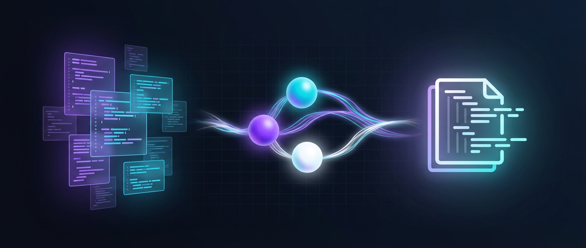

<p align="center">
    <a href="https://github.com/your-org/docutilians">
        
    </a>
</p>

<p align="center">
    <a href="#-quickstart">Quickstart</a>
    ·
    <a href="#-how-it-works">How it Works</a>
</p>


<p align="center">
    <strong>🚀 Multi-Agent Pipeline • 📝 Language Agnostic • ⚡ Recursive Type Analysis</strong>
</p>

---

> **✨ Say goodbye to manual API documentation!** Docutilians uses LLM-powered multi-agent architecture to automatically
> generate accurate OpenAPI specs from your source code.

## Introduction

**Docutilians** is a CLI tool that automatically generates OpenAPI specifications from your source code using LLM. No
more manual documentation—just point to your project and get a complete `openapi.yaml`.

### ✨ Key Features

| Feature                         | Description                                                               |
|---------------------------------|---------------------------------------------------------------------------|
| **🌐 Language Agnostic**        | Supports Kotlin, Java, TypeScript controllers and more                    |
| **🔍 Auto Type Analysis**       | Recursively scans DTOs, Enums, and Entities to build complete schemas     |
| **🤖 Multi-Agent Architecture** | File Collector → YAML Generator → Aggregator pipeline for higher accuracy |
| **📦 Single Output**            | Generates a clean, merged `openapi.yaml` ready for Swagger UI             |
| **📖 Built-in Docs Viewer**     | Generates Scalar HTML for instant API documentation preview               |

## 🚀 Quickstart

### Basic Usage

```bash
# Generate OpenAPI spec from your project
docutilians ./target-project

# With options
docutilians ./target-project -o ./docs/openapi -m claude-sonnet-4-5 -k sk-claudekey... -l KO
```

### CLI Options

| Option                 | Description                                            | Default                 |
|------------------------|--------------------------------------------------------|-------------------------|
| `-k, --claude-api-key` | Anthropic Claude API Key                               | `ANTHROPIC_API_KEY` env |
| `-m, --claude-model`   | Model to use (`claude-haiku-4-5`, `claude-sonnet-4-5`) | `claude-haiku-4-5`      |
| `-o, --openapi-output` | Output directory for generated files                   | `.docutilians/openapi`  |
| `-l, --language`       | Language for prompts (`EN`, `KO`)                      | `EN`                    |

## 🔄 How it Works

```
┌─────────────────────────────────────────┐
│ 1. Project Scanner                      │
│    Discovers controller files           │
└────────────────────┬────────────────────┘
                     ▼
┌─────────────────────────────────────────┐
│ 2. File Collector Agent                 │
│    Gathers referenced DTOs & Enums      │
└────────────────────┬────────────────────┘
                     ▼
┌─────────────────────────────────────────┐
│ 3. YAML Generator Agent                 │
│    Creates OpenAPI YAML per controller  │
└────────────────────┬────────────────────┘
                     ▼
┌─────────────────────────────────────────┐
│ 4. Aggregator                           │
│    Merges partials & generates HTML     │
└────────────────────┬────────────────────┘
                     ▼
         openapi.yaml + index.html ✅
```

## 📁 Output Structure

```
.docutilians/openapi/
├── partials/
│   ├── chat_controller.yaml
│   ├── user_controller.yaml
│   └── order_controller.yaml
├── openapi.yaml          # Final merged spec
└── index.html            # Scalar API docs viewer
```

> 💡 **Tip:** Open `index.html` directly in your browser — no server required!

## ⚖️ License

MIT License — see the [LICENSE](LICENSE) file for details.

---

<p align="center">
  Made with ❤️ by the Docutilians Team
</p>
